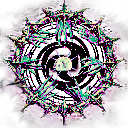

<p align="center">
  
</p>

<h1 align="center">Regradient</h1>

<p align="center">A simple app for quickly and easily applying a large number of gradients to a large number of photos.</p>

## Features & usage

You can drop in as many photos as you want at once, and load as many gradients as you want.

The app ships with 8 built-in gradients by default. Gradients use the `.grd` format — the same one Photoshop uses — so you can bring gradients straight from Photoshop.

On top of the built-in gradients, Regradient has a gradient editor: create your own gradients from scratch, or edit the existing ones. Gradients you create can be saved, and they're stored in the app's folder.

There's also a live gradient preview: once you've selected a gradient and already loaded a photo, that photo shows a preview of the gradient. The editor works the same way — but if you haven't loaded a photo yet, it defaults to a photo of a duck so you can still see the gradient on something :)

### The editor

The editor itself is kept as simple as possible: there's a basic color palette, a HEX palette for picking any color, and you can also enter a color as an RGB code. To add a new color stop, just left-click on the gradient bar. Above it is a separate transparency bar where you can change the gradient's opacity.

Overall the gradients are calculated with the same precision as Photoshop's Gradient Map, so blending shouldn't cause any problems (fingers crossed).

### Export

Exported files go to the folder you choose, named as `filename_gradientname`.

There are also 3 checkboxes that change how export behaves:

1. **Create a "Gradient Images" folder** — export creates a folder at your chosen path, and all exported photos with the gradient applied go there.
2. **Separate folder per gradient** — each gradient gets its own personal subfolder, named after the gradient.
3. **Also export the original** — export also includes a copy of your original photo, named `filename_default`.

P.S: do you like my psyhodelic icons?

## Installing

Download the installer from [Releases](../../releases) and run it — no admin rights needed, it installs per-user. The bundled sample gradients are installed alongside the app.

## Building from source

Requires [Node.js](https://nodejs.org/) and the [Rust toolchain](https://www.rust-lang.org/tools/install) (plus the [Tauri prerequisites](https://tauri.app/start/prerequisites/) for Windows).

```sh
npm install
npm run tauri dev     # run in development
npm run tauri build   # build the NSIS installer
```

The installer is written to `src-tauri/target/release/bundle/nsis/`.

## License

MIT — see [LICENSE](LICENSE).
